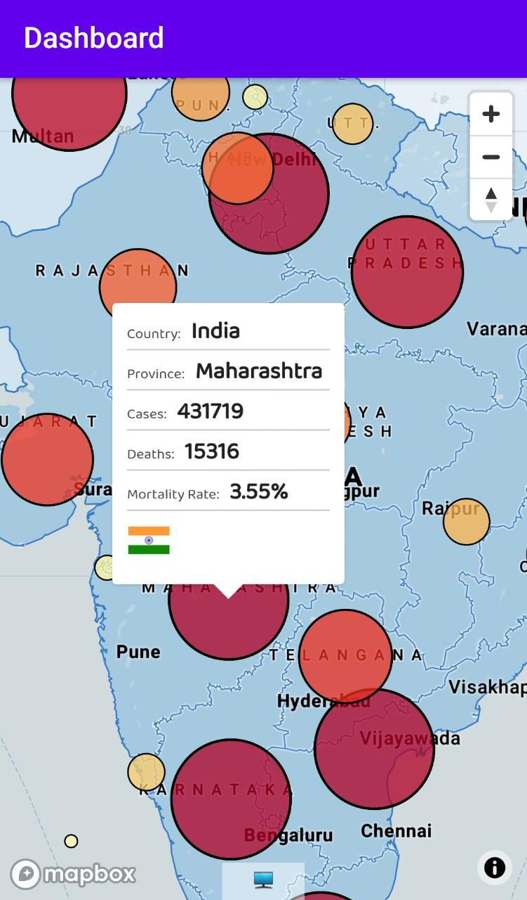
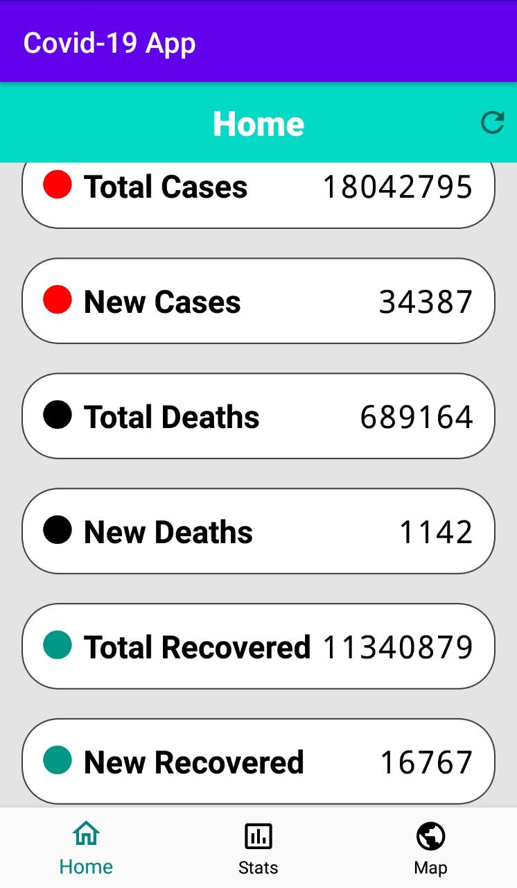
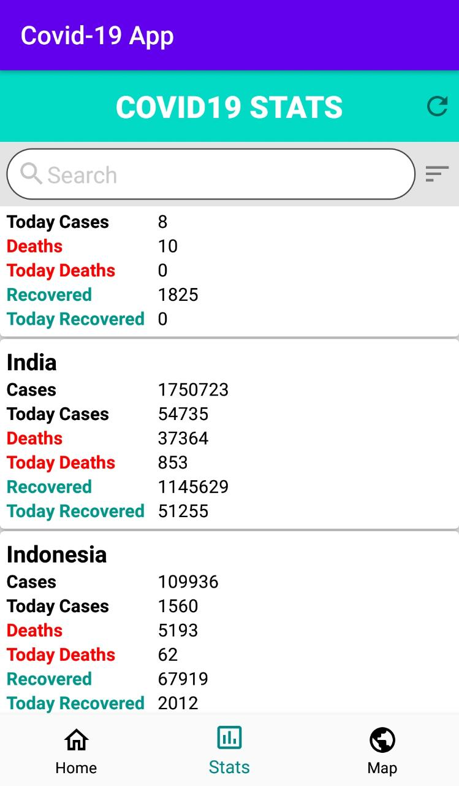
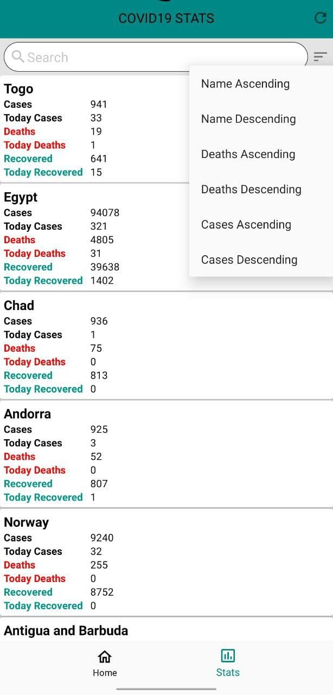

# Covid-Analysis-Android-app
An Android application for COVID-19 data analysis

<b>About project</b>

This is a android app project made for collecting and visualising the covid-19 statistics around the world and also of individual states. This app will use heat map from mapbox open source API to show places which are highly effected because of Corona virus. User can sort the countries list as per the cases and deaths. This app uses NovelCovid API for collecting the stats from all around the world and gets updated after every 10 mins. 
 

 

